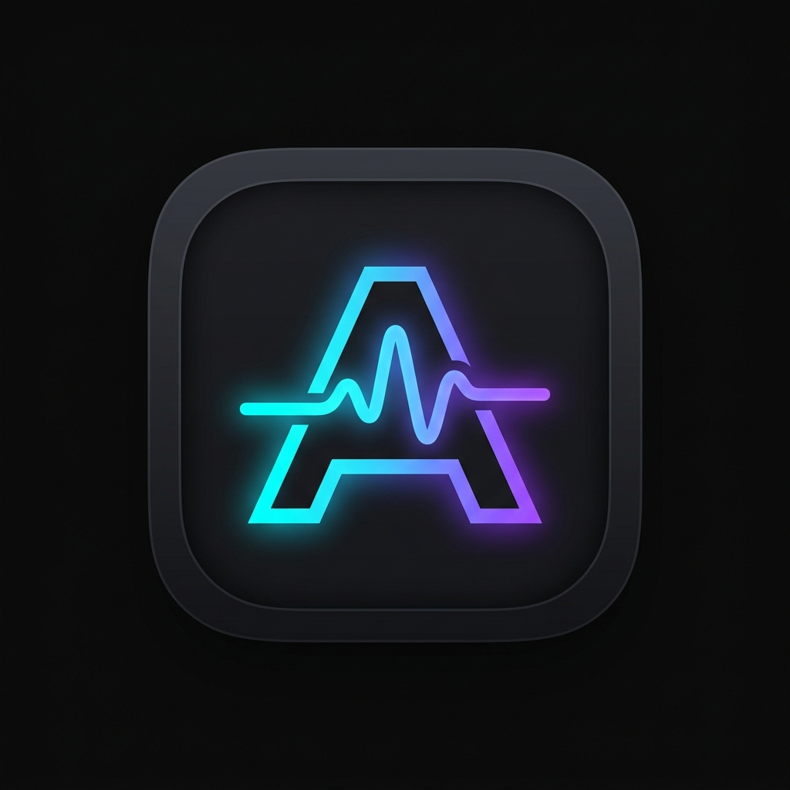

<div align="center">



# Audix — Multiplatform Music Player


<p align="center">
  <b>A modern, high-performance, extension-based music player built for Android and Desktop (Audix).</b><br>
  Powered by Kotlin Multiplatform, Compose Multiplatform, SQLDelight, and VLC audio playback.
</p>

</div>

---

## ⚡ Latest Release — v1.0.0

| Platform | Format | File | Size | Download |
| :--- | :--- | :--- | :--- | :--- |
| 📱 **Android** (SDK 24+) | **APK** | `Audix-v1.0.0-Android.apk` | ~9.5 MB | [⬇️ **Download APK**](release-artifacts/Audix-v1.0.0-Android.apk) \| [GitHub Release](https://github.com/aaweshdas/Audix-Multiplatform-Music-Player/releases/latest) |
| 💻 **Windows** (x64) | **MSI Installer** | `Audix-v1.0.0-Windows-Installer.msi` | ~164 MB | [⬇️ **Download MSI**](release-artifacts/Audix-v1.0.0-Windows-Installer.msi) \| [GitHub Release](https://github.com/aaweshdas/Audix-Multiplatform-Music-Player/releases/latest) |
| 📦 **Windows** (x64) | **Portable ZIP** | `Audix-v1.0.0-Windows-Portable.zip` | ~162.8 MB | [⬇️ **Download ZIP**](release-artifacts/Audix-v1.0.0-Windows-Portable.zip) \| [GitHub Release](https://github.com/aaweshdas/Audix-Multiplatform-Music-Player/releases/latest) |

> [!TIP]
> **New to Audix?** Follow the quick steps below to load your music and install extensions in seconds!

### 📥 How to Install & Add Extensions in Audix
1. **Download & Install**: Install `Audix-v1.0.0-Android.apk` on your Android device (or launch `Audix.exe` on Windows).
2. **Open Extensions**: Tap the **Extensions** icon in the navigation bar.
3. **Tap Add (`+`)**: Tap the **Add Extension** button.
4. **Enter Shortcode or URL**:
   - Simply type **`extension`** (or leave it blank) and tap **Add**.
   - Or paste the official community repository URL:
     ```
     https://raw.githubusercontent.com/itsmechinmoy/echo-extensions/main/echo_extensions.json
     ```
5. **Select Your Sources**: Check **YouTube Music**, **Saavn Music**, **SoundCloud**, **Radio Browser**, or **Lyrics** providers and tap **Add**.
6. **Enjoy Music!** All songs, search results, charts, and radio stations will immediately load on your home feed.

---

### ✨ What's New in v1.0.0
- 🚀 **Cross-Platform Audio Engine**: Support for Media3 ExoPlayer on Android and VLCJ on Windows Desktop.
- 🔌 **Dynamic Extension Loader**: Resolved all package discovery, DEX loading, and URL shortener resolution issues.
- 🎵 **Built-In Offline & Spotify Playback**: Instant playback of your local music library and popular Spotify charts.
- 🔒 **Security & Network**: Fixed network security configurations to support HTTP radio streams and third-party extension endpoints.
- 📱 **Android 14+ Ready**: Foreground service playback controls, lockscreen media session integration, and edge-to-edge support.
- 🎨 **Modern Design**: Refined Material 3 Glassmorphic UI with vibrant artwork, dynamic gradient backgrounds, and responsive navigation.

---

## 📖 Overview

**Audix** is an extensible, privacy-conscious audio player. Rather than hardcoding fixed streaming services, Audix features a decoupled **Extension SPI Architecture** that dynamically loads audio sources, metadata providers, synchronized lyrics engines, and social integrations at runtime.

The desktop client (**Audix**) provides an immersive, desktop-grade interface featuring smooth animations, hardware-accelerated playback, dynamic lyrics sync, visualizers, system tray minimization, and media key support.

> [!NOTE]
> Audix is designed as an offline player and extension host. The application itself hosts zero content and does not condone piracy. Users configure their own extensions and manage their own local libraries.

---

## 🏗️ Architecture & Modules

The workspace is organized into four modular Kotlin Multiplatform (KMP) modules:

```
┌─────────────────────────────────────────────────────────────────┐
│                           Audix Workspace                       │
├─────────────────┬─────────────────┬──────────────┬──────────────┤
│      :app       │   :desktopApp   │    :core     │   :common    │
│  (Android App)  │(Compose Desktop)│(DB & Engine) │ (Domain SPI) │
└─────────────────┴─────────────────┴──────────────┴──────────────┘
```

| Module | Target | Description |
| :--- | :--- | :--- |
| [**:app**](file:///s:/All%20Code/Antigravity/echo-nightly/app) | Android (SDK 24–36) | Android application with Material 3 UI, background playback services, home widgets, and Media3 ExoPlayer. App name: **Audix**. |
| [**:desktopApp**](file:///s:/All%20Code/Antigravity/echo-nightly/desktopApp) | JVM / Desktop | Modern Compose Multiplatform desktop client (**Audix**). Implements Decompose navigation, Koin DI, VLC audio playback, and Windows tray/media keys. |
| [**:core**](file:///s:/All%20Code/Antigravity/echo-nightly/core) | Common & JVM | Shared business logic, SQLDelight database (`EchoDatabase`), VLCJ playback engine, and dynamic JAR extension loader. |
| [**:common**](file:///s:/All%20Code/Antigravity/echo-nightly/common) | Kotlin Multiplatform | Core domain models (`Track`, `Album`, `Artist`, `Playlist`), client interfaces, and Extension SPI. |

---

## 📂 Directory Layout

The workspace has been organized cleanly order-wise at the root:

```
echo-nightly/
├── .github/                         # GitHub Actions workflows & issue templates
├── .gitignore                       # Git ignore specifications
├── AI_POLICY.md                     # Project AI and contribution policies
├── LICENSE.md                       # GNU General Public License v3.0
├── README.md                        # Master project documentation
├── Run-Audix.bat                    # Primary Windows desktop launcher script
├── Run-Echo.bat                     # Fallback Windows desktop launcher script
│
├── app/                             # [Module] Android Application (Audix)
│   ├── src/main/                    # Android source code & resources
│   └── build.gradle.kts             # Android build configuration
│
├── common/                          # [Module] KMP Extension SPI & Domain Models
│   ├── src/commonMain/kotlin/       # Shared interfaces (AlbumClient, TrackClient, etc.)
│   └── build.gradle.kts             # Common multiplatform build script
│
├── core/                            # [Module] Platform Engine, DB & Extensions
│   ├── src/commonMain/sqldelight/   # SQLDelight database schemas (Downloads, Extensions, Users)
│   ├── src/desktopMain/kotlin/      # VLC player, JarExtensionRepository, LocalMusicExtension
│   └── build.gradle.kts             # Core build script
│
├── desktopApp/                      # [Module] Audix Compose Desktop Application
│   ├── src/desktopMain/kotlin/      # Compose UI, screens, viewmodels, desktop entry
│   └── build.gradle.kts             # Compose Multiplatform packaging & native distribution
│
├── gradle/                          # Gradle wrapper & dependency version catalog
│   ├── libs.versions.toml           # Unified version catalog
│   └── wrapper/                     # Gradle wrapper JAR and properties
│
├── scripts/                         # Developer & maintenance utilities
│   └── scratch_capture.ps1          # Diagnostic window capture utility
│
├── tools/                           # Development tools and reference assets
│   ├── assets/                      # Official branding & logo artwork (audix_logo.jpg)
│   ├── sample-extensions/           # Sample extension packages and manifests
│   │   ├── test_ext.zip             # Dalvik/DEX sample Android extension APK
│   │   └── saavn-manifest/          # Unpacked Saavn Music extension manifest
│   └── recovered-reference/         # Decompiled source code & class reference archives
│
├── build.gradle.kts                 # Root Gradle build script
├── settings.gradle.kts              # Root Gradle settings (module registry & repos)
├── gradle.properties                # JVM, Kotlin & build configuration flags
├── gradlew / gradlew.bat            # Gradle wrapper scripts
├── jitpack.yml                      # JitPack build configuration
└── local.properties                 # Local Android SDK path configuration
```

---

## 🧩 Extension Ecosystem

Audix features a modular plugin architecture where capabilities are added through standalone extension JARs loaded at runtime:

| Extension | Category | Capability |
| :--- | :--- | :--- |
| **YouTube Music** (`youtube.jar`) | Audio Streaming | Search, browse charts, stream audio streams with adaptive bitrates. |
| **JioSaavn** (`saavn.jar`) | Audio Streaming | High-bitrate Bollywood, regional, and international catalog streaming. |
| **SoundCloud** (`soundcloud.jar`) | Audio Streaming | User tracks, indie releases, and playlists. |
| **Radio Browser** (`radiobrowser.jar`) | Radio Stations | Global directory of thousands of live internet radio streams. |
| **LRCLIB** (`lrclib.jar`) | Synchronized Lyrics | Time-synced scrolling lyrics database. |
| **Musixmatch** (`musixmatch.jar`) | Lyrics Provider | Comprehensive lyrics search and rich text lyrics. |
| **Genius** (`genius.jar`) | Lyrics & Annotations | Song lyrics, background notes, and track annotations. |
| **Discord RPC** (`discordrpc.jar`) | Social Integration | Live Discord Rich Presence with track title, artist, and playback status. |
| **Last.fm** (`lastfm.jar`) | Scrobbling | Automatic playback scrobbling and listening history synchronization. |

Extensions are stored locally under:
- **Windows**: `%APPDATA%\Echo\extensions\`

---

## 🚀 Getting Started

### Prerequisites

- **JDK 21** or higher (Java 21 LTS recommended)
- **Android SDK** (API 34+ build-tools) for building the Android application
- **VLC Media Player** (64-bit) installed for desktop playback via `vlcj`

### Launch Desktop (Audix)

To quickly run the desktop application on Windows:
```cmd
.\Run-Audix.bat
```

Or via Gradle directly:
```powershell
.\gradlew.bat :desktopApp:run
```

### Package Desktop Executable / Installer

Build a standalone native Windows distribution for Audix (bundled with JRE):
```powershell
.\gradlew.bat :desktopApp:packageDistributionForCurrentOS
```
The output executable will be created in:
`desktopApp/build/compose/binaries/main/app/Audix/Audix.exe`

### Build Android APK

Build a debug or nightly APK for Audix:
```powershell
.\gradlew.bat :app:assembleNightly
```

---

## 🛠️ Diagnostics & Developer Scripts

- **Inspect Project Modules**:
  ```powershell
  .\gradlew.bat projects
  ```
- **Capture Window Diagnostics**:
  ```powershell
  powershell -ExecutionPolicy Bypass -File scripts\scratch_capture.ps1
  ```
- **Sample Extensions & Manifests**:
  Inspect sample extension manifests in `tools/sample-extensions/saavn-manifest/META-INF/MANIFEST.MF`.

---

## 📜 Community & Support

Join the official community for news, extension development guides, and nightly updates:
- **Discord**: [Join Official Server](https://discord.gg/J3WvbBUU8Z)

---

## ⚖️ License

Audix is free software licensed under the **GNU General Public License v3.0** (GPL-3.0). See [LICENSE.md](file:///s:/All%20Code/Antigravity/echo-nightly/LICENSE.md) for full details.
